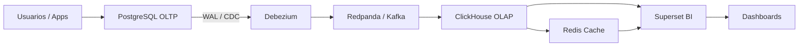

# Plataforma de Datos OLTP → CDC → OLAP → BI

> Plataforma reproducible para replicar cambios desde PostgreSQL hacia ClickHouse y visualizarlos en Apache Superset.

## Objetivo

La plataforma permite capturar cambios desde PostgreSQL, transportarlos por Redpanda/Kafka, almacenarlos en ClickHouse y consumirlos en Superset para analítica y tableros.

## Diagrama de flujo



## Arquitectura por capas

| Capa | Tecnología | Función |
|---|---|---|
| Origen | PostgreSQL 16 | Base transaccional |
| CDC | Debezium Connect 2.5 | Captura cambios del WAL |
| Mensajería | Redpanda | Transporte de eventos |
| Analítica | ClickHouse | Almacenamiento OLAP |
| Caché | Redis 7 | Acelera consultas en Superset |
| BI | Apache Superset 6 | Visualización y dashboards |

## Fases del proyecto

| Fase | Estado | Descripción |
|---|---|---|
| 1. Infraestructura base | Completada | Docker Compose, red interna, volúmenes y contenedores |
| 2. Origen transaccional | Completada | PostgreSQL con WAL lógico habilitado |
| 3. CDC y mensajería | Completada | Debezium + Redpanda para capturar y transportar eventos |
| 4. Capa analítica | Completada | ClickHouse como destino OLAP |
| 5. BI y caché | Completada | Superset con Redis para dashboards |
| 6. Vistas y tablas genéricas | En progreso | Estandarización de modelos y plantillas de datos dummy |
| 7. Tableros ejecutivos | En progreso | Dashboards reutilizables para usuarios finales |
| 8. IA en Superset | Futuro | Asistente para consultas, resúmenes y generación de insights |
| 9. Automatización avanzada | Futuro | Alertas, reportes programados y monitoreo |

## Modelo de vistas y tablas

La idea es separar la capa operativa de la capa analítica. En PostgreSQL viven las tablas de origen y vistas de negocio; en ClickHouse viven tablas espejo o desnormalizadas para consumo rápido.

### Tablas base

- Tablas transaccionales en PostgreSQL.
- Tablas analíticas en ClickHouse con nombres equivalentes o prefijos claros.
- Datos dummy para pruebas y demostraciones.

### Vistas sugeridas

- `vw_resumen_operativo`
- `vw_kpis_diarios`
- `vw_movimientos_mensuales`
- `vw_dashboard_ejecutivo`

### Tablas dummy sugeridas

- `dim_usuarios`
- `dim_producto`
- `dim_fecha`
- `fact_ventas`
- `fact_eventos`

## Dashboards genéricos sugeridos

- Resumen ejecutivo
- Operación diaria
- Tendencias por periodo
- Calidad de datos
- Monitoreo de carga CDC

---

## Ejemplo completo — Replicar una tabla con soporte CDC

Este ejemplo usa una tabla dummy `dim_producto` para mostrar el flujo completo desde PostgreSQL hasta ClickHouse, incluyendo INSERT, UPDATE y DELETE en tiempo real.

### PASO 1 — Crear la tabla en PostgreSQL y habilitar replicación

```sql
-- Crear tabla en PostgreSQL
CREATE TABLE public.dim_producto (
    id          UUID PRIMARY KEY DEFAULT gen_random_uuid(),
    nombre      VARCHAR(100) NOT NULL,
    categoria   VARCHAR(50),
    precio      NUMERIC(10,2),
    activo      BOOLEAN DEFAULT true
);

-- Insertar datos dummy
INSERT INTO public.dim_producto (nombre, categoria, precio) VALUES
    ('Laptop Pro 15',   'Electronica',  25999.99),
    ('Mouse Inalambrico','Accesorios',    349.00),
    ('Teclado Mecanico','Accesorios',    899.50),
    ('Monitor 27"',     'Electronica',  8499.00),
    ('Webcam HD',       'Accesorios',   1299.00);

-- Habilitar captura completa de cambios para Debezium
ALTER TABLE public.dim_producto REPLICA IDENTITY FULL;
```

### PASO 2 — Registrar el conector Debezium

Ejecuta esto desde la terminal donde corre tu plataforma:

```bash
curl -X POST http://localhost:8083/connectors \
  -H "Content-Type: application/json" \
  -d '{
    "name": "connector-dim-producto",
    "config": {
      "connector.class": "io.debezium.connector.postgresql.PostgresConnector",
      "database.hostname": "postgres",
      "database.port": "5432",
      "database.user": "admin",
      "database.password": "admin123",
      "database.dbname": "analyticsdb",
      "database.server.name": "analytics",
      "topic.prefix": "analytics",
      "schema.include.list": "public",
      "table.include.list": "public.dim_producto",
      "plugin.name": "pgoutput",
      "snapshot.mode": "always",
      "key.converter": "org.apache.kafka.connect.json.JsonConverter",
      "value.converter": "org.apache.kafka.connect.json.JsonConverter",
      "key.converter.schemas.enable": "false",
      "value.converter.schemas.enable": "false",
      "transforms": "unwrap",
      "transforms.unwrap.type": "io.debezium.transforms.ExtractNewRecordState",
      "transforms.unwrap.drop.tombstones": "false",
      "transforms.unwrap.delete.handling.mode": "rewrite"
    }
  }'
```

Verificar que el topic se creó en Redpanda:

```bash
docker exec -it redpanda rpk topic list | grep dim_producto
# Esperado:
# analytics.public.dim_producto   1   1
```

Verificar que el conector está activo:

```bash
curl http://localhost:8083/connectors/connector-dim-producto/status
# Esperado: "state": "RUNNING"
```

### PASO 3 — Crear las estructuras en ClickHouse

Ejecuta los siguientes bloques en el portal web de ClickHouse (`http://localhost:18123`).

**3.1 — Tabla destino final**

```sql
CREATE TABLE analytics.dim_producto (
    id          UUID,
    nombre      String,
    categoria   String,
    precio      Decimal(10,2),
    activo      UInt8,
    __deleted   UInt8 DEFAULT 0
) ENGINE = ReplacingMergeTree(__deleted)
ORDER BY id;
```

**3.2 — Tabla Kafka (cola de entrada)**

```sql
CREATE TABLE analytics.kafka_dim_producto (
    id          UUID,
    nombre      String,
    categoria   String,
    precio      Decimal(10,2),
    activo      UInt8,
    __deleted   UInt8
) ENGINE = Kafka
SETTINGS kafka_broker_list = 'redpanda:9092',
         kafka_topic_list   = 'analytics.public.dim_producto',
         kafka_group_name   = 'clickhouse_analytics',
         kafka_format       = 'JSONEachRow';
```

**3.3 — Materialized View (puente automático)**

```sql
CREATE MATERIALIZED VIEW analytics.dim_producto_mv TO analytics.dim_producto
AS SELECT
    id,
    nombre,
    categoria,
    precio,
    activo,
    if(__deleted = 1, 1, 0) AS __deleted
FROM analytics.kafka_dim_producto;
```

**3.4 — Vista limpia para Superset**

```sql
CREATE VIEW analytics.vw_dim_producto AS
SELECT id, nombre, categoria, precio, activo
FROM analytics.dim_producto FINAL
WHERE __deleted = 0;
```

### PASO 4 — Probar INSERT, UPDATE y DELETE

Ejecuta estos cambios en PostgreSQL y verifica en ClickHouse después de cada uno:

```sql
-- INSERT: agregar un nuevo producto
INSERT INTO public.dim_producto (nombre, categoria, precio)
VALUES ('Audífonos Bluetooth', 'Accesorios', 1599.00);

-- UPDATE: modificar el precio de un producto existente
UPDATE public.dim_producto
SET precio = 27999.99
WHERE nombre = 'Laptop Pro 15';

-- DELETE: dar de baja un producto
DELETE FROM public.dim_producto
WHERE nombre = 'Webcam HD';
```

Verificar en ClickHouse:

```sql
-- Ver todos los registros activos (sin borrados, sin duplicados)
SELECT * FROM analytics.vw_dim_producto;

-- Contar registros activos
SELECT count(*) FROM analytics.dim_producto FINAL WHERE __deleted = 0;

-- Ver incluyendo borrados lógicos
SELECT *, __deleted FROM analytics.dim_producto FINAL;
```

> **Nota:** Usar siempre `vw_dim_producto` en Superset. La vista aplica `FINAL` y filtra `__deleted = 0` automáticamente, garantizando datos limpios y sin duplicados temporales.

---

## Ejemplo de tabla dummy

```sql
CREATE DATABASE IF NOT EXISTS analytics;

CREATE TABLE analytics.fact_ventas (
    id         UInt64,
    fecha      DateTime,
    usuario    String,
    categoria  String,
    monto      Decimal(12,2),
    estado     String,
    updated_at DateTime
) ENGINE = ReplacingMergeTree(updated_at)
ORDER BY id;
```

## Ejemplo de flujo de datos

```text
INSERT / UPDATE / DELETE en PostgreSQL
   ↓
Debezium captura el cambio desde el WAL
   ↓
Redpanda publica el evento al topic
   ↓
ClickHouse consume y almacena via Materialized View
   ↓
Superset consulta la vista limpia y grafica
```

## Instalación

```bash
git clone <repo>
cd data-platform
chmod +x setup.sh
./setup.sh
```

## Accesos

| Servicio | URL |
|---|---|
| Superset | http://localhost:8088 |
| ClickHouse HTTP | http://localhost:18123 |
| Debezium REST | http://localhost:8083 |
| PostgreSQL | localhost:5432 |
| Redpanda | localhost:9092 |

## Futuros complementos

- Asistente IA dentro de Superset
- Datasets reutilizables por área de negocio
- Vistas materializadas para KPIs
- Alertas automáticas
- Catálogo de métricas