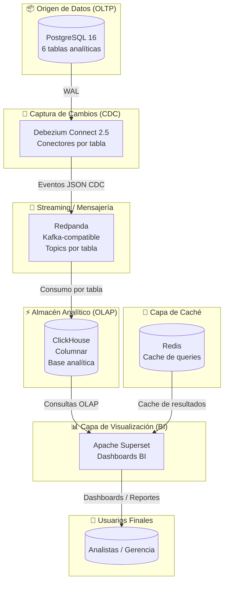
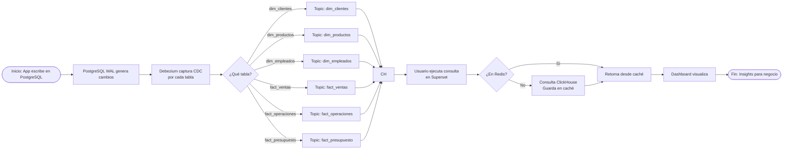
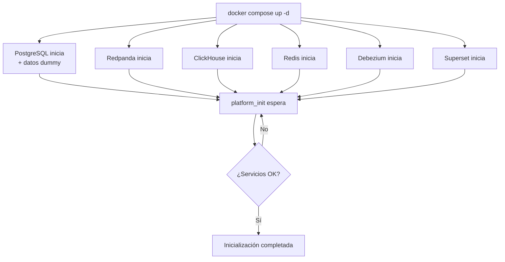

# 🏗️ Plataforma de Datos OLTP → CDC → OLAP → BI

> **Stack:** PostgreSQL 16 · Debezium 2.5 · Redpanda (Kafka-compatible) · ClickHouse · Apache Superset 6.0 · Redis · Docker Compose

---

## 1. Objetivo

Diseñar e implementar una plataforma de datos moderna que permita:

- Replicar datos desde PostgreSQL (OLTP) en tiempo casi real mediante CDC
- Desacoplar completamente la carga analítica del sistema transaccional
- Acelerar consultas analíticas con ClickHouse (OLAP columnar)
- Visualizar información con Apache Superset de forma segura y cacheada con Redis
- Garantizar reproducibilidad y portabilidad completa mediante Docker Compose

---

## 2. Diagrama de Arquitectura (Mermaid)



## 3. Diagrama de Flujo de Datos (Secuencia completa)



## 4. Diagrama de Flujo de Inicialización (Docker Compose)



## 6. Tabla de Fases del Proyecto

| # | Fase | Descripción | Estado |
|---|------|-------------|--------|
| 1 | Infraestructura base | Docker Compose con PostgreSQL, Redpanda, Debezium, ClickHouse, Redis, Superset | ✅ Completado |
| 2 | CDC con Debezium | Replicación lógica de 6 tablas del schema analytics | ✅ Completado |
| 3 | Datos dummy | Tablas y datos de prueba end-to-end | ✅ Completado |
| 4 | Conexión ClickHouse → Superset | Script automático vía API REST | ✅ Completado |
| 5 | Dashboards BI | 7 dashboards importados automáticamente | ✅ Completado |
| 6 | Init automatizado | Orquestación completa | ✅ Completado |
| 7 | Alertas y correos | Superset Alerts & Reports con SMTP | ⬜ Siguiente |
| 8 | Dashboard de monitoreo | Salud de la plataforma | ⬜ Pendiente |
| 9 | Authentik (SSO/IdP) | OIDC / SAML para Superset | ⬜ Pendiente |
|10 | API Gateway | Traefik o Nginx | ⬜ Pendiente |
|11 | Hardening producción | Seguridad y backups | ⬜ Pendiente |
|12 | Observabilidad | Prometheus + Grafana | ⬜ Futuro |

## 7. Servicios del Stack

| Servicio | Imagen | Puerto | Rol |
|--------|--------|--------|-----|
| postgres | postgres:16 | 5432 | Fuente OLTP, WAL lógico |
| redpanda | redpandadata/redpanda:v23.3.10 | 9092 | Broker Kafka-compatible |
| debezium | debezium/connect:2.5 | 8083 | CDC connector |
| clickhouse | clickhouse/clickhouse-server | 8123 / 9000 | OLAP columnar |
| redis | redis:7 | 6379 | Cache Superset |
| superset | apache/superset:6.0.0 | 8088 | BI |
| platform_init | custom | — | Orquestador |

## 8. Conectores Debezium activos

```text
analytics-dim-clientes      → topic: analytics.analytics.dim_clientes
analytics-dim-productos     → topic: analytics.analytics.dim_productos
analytics-dim-empleados     → topic: analytics.analytics.dim_empleados
analytics-fact-ventas       → topic: analytics.analytics.fact_ventas
analytics-fact-operaciones  → topic: analytics.analytics.fact_operaciones
analytics-fact-presupuesto  → topic: analytics.analytics.fact_presupuesto
```

## 9. Dashboards importados en Superset

| Dashboard | Archivo ZIP |
|----------|-------------|
| Ventas | dashboard_ventas.zip |
| Operaciones | dashboard_operaciones.zip |
| Clientes | dashboard_clientes.zip |
| Productos | dashboard_productos.zip |
| Empleados | dashboard_empleados.zip |
| Presupuesto | dashboard_presupuesto.zip |
| Analytics General | dashboard_analytics_general.zip |
