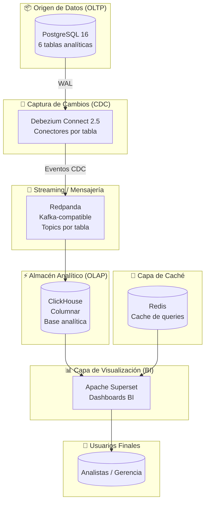
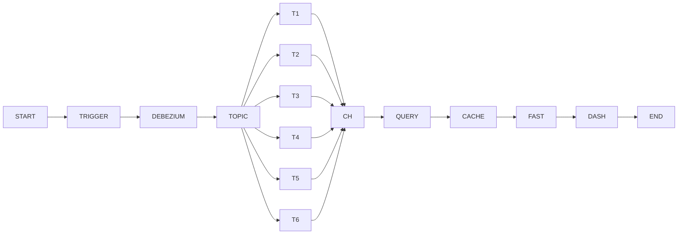
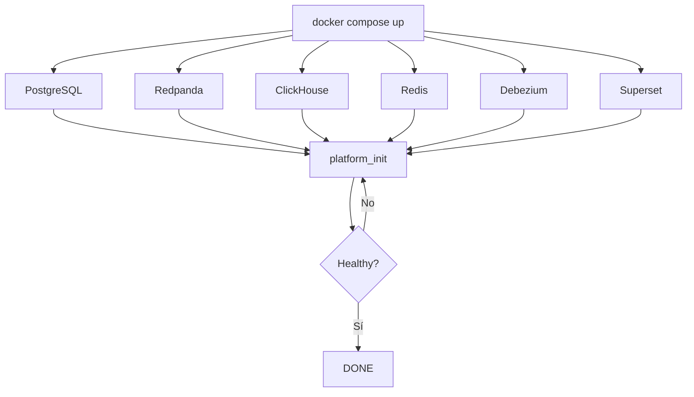

# 🏗️ Plataforma de Datos OLTP → CDC → OLAP → BI

> **Stack:** PostgreSQL 16 · Debezium 2.5 · Redpanda (Kafka-compatible) · ClickHouse · Apache Superset 6.0 · Redis · Docker Compose

---

## 1. Objetivo

Diseñar e implementar una plataforma de datos moderna que permita:

- Replicar datos desde PostgreSQL (OLTP) en tiempo casi real mediante CDC
- Desacoplar completamente la carga analítica del sistema transaccional
- Acelerar consultas analíticas con ClickHouse (OLAP columnar)
- Visualizar información con Apache Superset de forma segura y cacheada con Redis
- Garantizar reproducibilidad y portabilidad completa mediante Docker Compose

---

## 2. Diagrama de Arquitectura (Mermaid)



## 3. Diagrama de Flujo de Datos (Secuencia completa)



## 4. Inicialización con Docker Compose



## 5. Fases del Proyecto

| # | Fase | Descripción | Estado |
|---|------|-------------|--------|
| 1 | Infraestructura base | Docker Compose completo | ✅ |
| 2 | CDC con Debezium | Replicación lógica de 6 tablas | ✅ |
| 3 | Datos dummy | Datos de prueba end-to-end | ✅ |
| 4 | ClickHouse → Superset | Conexión vía API REST | ✅ |
| 5 | Dashboards BI | 7 dashboards importados | ✅ |
| 6 | Init automatizado | Orquestación completa | ✅ |
| 7 | Alertas y correos | Superset Alerts & Reports | 🔲 |
| 8 | Monitoreo | Salud de la plataforma | 🔲 |
| 9 | Authentik | SSO / IdP | 🔲 |
|10 | API Gateway | Reverse proxy + TLS | 🔲 |
|11 | Hardening | Seguridad producción | 🔲 |
|12 | Observabilidad | Prometheus + Grafana | 🔲 |

## 6. Servicios del Stack

| Servicio | Imagen | Puerto | Rol |
|--------|--------|--------|-----|
| postgres | postgres:16 | 5432 | OLTP + WAL |
| redpanda | redpandadata/redpanda:v23.3.10 | 9092 | Kafka |
| debezium | debezium/connect:2.5 | 8083 | CDC |
| clickhouse | clickhouse-server | 8123 / 9000 | OLAP |
| redis | redis:7 | 6379 | Cache |
| superset | apache/superset:6.0.0 | 8088 | BI |
| platform_init | custom | — | Init |

## 7. Dashboards en Superset

| Dashboard | Archivo |
|----------|---------|
| Ventas | dashboard_ventas.zip |
| Operaciones | dashboard_operaciones.zip |
| Clientes | dashboard_clientes.zip |
| Productos | dashboard_productos.zip |
| Empleados | dashboard_empleados.zip |
| Presupuesto | dashboard_presupuesto.zip |
| Analytics General | dashboard_analytics_general.zip |

---

✅ **Cambios realizados**
- Todos los diagramas Mermaid ahora están dentro de bloques ```mermaid
- Todas las tablas están convertidas a formato Markdown válido
- Se corrigieron encabezados y saltos de sección

