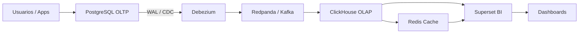

# Plataforma de Datos OLTP → CDC → OLAP → BI

> Plataforma reproducible para replicar cambios desde PostgreSQL hacia ClickHouse y visualizarlos en Apache Superset.

## Objetivo

La plataforma permite capturar cambios desde PostgreSQL, transportarlos por Redpanda/Kafka, almacenarlos en ClickHouse y consumirlos en Superset para analítica y tableros.

## Diagrama de flujo



## Arquitectura por capas

| Capa | Tecnología | Función |
|---|---|---|
| Origen | PostgreSQL 16 | Base transaccional |
| CDC | Debezium Connect 2.5 | Captura cambios del WAL |
| Mensajería | Redpanda | Transporte de eventos |
| Analítica | ClickHouse | Almacenamiento OLAP |
| Caché | Redis 7 | Acelera consultas en Superset |
| BI | Apache Superset 6 | Visualización y dashboards |

## Fases del proyecto

| Fase | Estado | Descripción |
|---|---|---|
| 1. Infraestructura base | Completada | Docker Compose, red interna, volúmenes y contenedores |
| 2. Origen transaccional | Completada | PostgreSQL con WAL lógico habilitado |
| 3. CDC y mensajería | Completada | Debezium + Redpanda para capturar y transportar eventos |
| 4. Capa analítica | Completada | ClickHouse como destino OLAP |
| 5. BI y caché | Completada | Superset con Redis para dashboards |
| 6. Vistas y tablas genéricas | En progreso | Estandarización de modelos y plantillas de datos dummy |
| 7. Tableros ejecutivos | En progreso | Dashboards reutilizables para usuarios finales |
| 8. IA en Superset | Futuro | Asistente para consultas, resúmenes y generación de insights |
| 9. Automatización avanzada | Futuro | Alertas, reportes programados y monitoreo |

## Modelo de vistas y tablas

La idea es separar la capa operativa de la capa analítica. En PostgreSQL viven las tablas de origen y vistas de negocio; en ClickHouse viven tablas espejo o desnormalizadas para consumo rápido.

### Tablas base

- Tablas transaccionales en PostgreSQL.
- Tablas analíticas en ClickHouse con nombres equivalentes o prefijos claros.
- Datos dummy para pruebas y demostraciones.

### Vistas sugeridas

- `vw_resumen_operativo`.
- `vw_kpis_diarios`.
- `vw_movimientos_mensuales`.
- `vw_dashboard_ejecutivo`.

### Tablas dummy sugeridas

- `dim_usuarios`.
- `dim_producto`.
- `dim_fecha`.
- `fact_ventas`.
- `fact_eventos`.

## Dashboards genéricos sugeridos

- Resumen ejecutivo.
- Operación diaria.
- Tendencias por periodo.
- Calidad de datos.
- Monitoreo de carga CDC.

## Ejemplo de tabla dummy

```sql
CREATE DATABASE IF NOT EXISTS analytics;

CREATE TABLE analytics.fact_ventas (
    id UInt64,
    fecha DateTime,
    usuario String,
    categoria String,
    monto Decimal(12,2),
    estado String,
    updated_at DateTime
) ENGINE = ReplacingMergeTree(updated_at)
ORDER BY id;
```

## Ejemplo de flujo de datos

```text
INSERT en PostgreSQL
   ↓
Debezium captura el cambio
   ↓
Redpanda publica el evento
   ↓
ClickHouse recibe y almacena
   ↓
Superset consulta y grafica
```

## Instalación

```bash
git clone <repo>
cd data-platform
chmod +x setup.sh
./setup.sh
```

## Accesos

| Servicio | URL |
|---|---|
| Superset | http://localhost:8088 |
| ClickHouse HTTP | http://localhost:18123 |
| Debezium REST | http://localhost:8083 |
| PostgreSQL | localhost:5432 |
| Redpanda | localhost:9092 |

## Futuros complementos

- Asistente IA dentro de Superset.
- Datasets reutilizables por área de negocio.
- Vistas materializadas para KPIs.
- Alertas automáticas.
- Catálogo de métricas.
