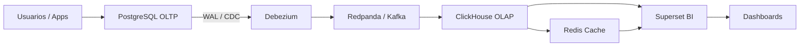

# Plataforma de Datos OLTP → CDC → OLAP → BI

> Plataforma reproducible para replicar cambios desde PostgreSQL hacia ClickHouse y visualizarlos en Apache Superset.

## Objetivo

La plataforma permite capturar cambios desde PostgreSQL, transportarlos por Redpanda/Kafka, almacenarlos en ClickHouse y consumirlos en Superset para analítica y tableros.

## Diagrama de flujo



## Arquitectura por capas

| Capa | Tecnología | Función |
|---|---|---|
| Origen | PostgreSQL 16 | Base transaccional |
| CDC | Debezium Connect 2.5 | Captura cambios del WAL |
| Mensajería | Redpanda | Transporte de eventos |
| Analítica | ClickHouse | Almacenamiento OLAP |
| Caché | Redis 7 | Acelera consultas en Superset |
| BI | Apache Superset 6 | Visualización y dashboards |

## Fases del proyecto

| Fase | Estado | Descripción |
|---|---|---|
| 1. Infraestructura base | Completada | Docker Compose, red interna, volúmenes y contenedores |
| 2. Origen transaccional | Completada | PostgreSQL con WAL lógico habilitado y límite de logs a 1 GB |
| 3. CDC y mensajería | Completada | Debezium + Redpanda para capturar y transportar eventos |
| 4. Capa analítica | Completada | ClickHouse como destino OLAP |
| 5. BI y caché | Completada | Superset con Redis para dashboards |
| 6. Vistas y tablas genéricas | Completada | Tablas dummy con flujo CDC completo listas para tableros ejecutivos |
| 7. Tableros ejecutivos | En progreso | Dashboards reutilizables para usuarios finales |
| 8. IA en Superset | Futuro | Asistente para consultas, resúmenes y generación de insights |
| 9. Automatización avanzada | Futuro | Alertas, reportes programados y monitoreo del pipeline |
| 10. Seguridad y accesos | Futuro | Keycloak para autenticación centralizada y API Gateway como punto de entrada único |

## Instalación

```bash
git clone <repo>
cd data-platform
docker compose up -d
```

Eso es todo. La plataforma se configura sola:
1. Levanta todos los contenedores en orden
2. Espera a que cada servicio esté listo usando healthchecks
3. Crea las tablas dummy en PostgreSQL con datos de ejemplo
4. Crea las estructuras en ClickHouse
5. Registra los conectores Debezium automáticamente

> Si necesitas re-registrar solo los conectores Debezium después de reiniciar:
> ```bash
> bash sh/03_debezium_connectors.sh
> ```

## Accesos

| Servicio | URL |
|---|---|
| Superset | http://localhost:8088 (admin/admin) |
| ClickHouse HTTP | http://localhost:18123 |
| Debezium REST | http://localhost:8083 |
| PostgreSQL | localhost:5432 |
| Redpanda | localhost:9092 |

## Estructura del repositorio

```
data-platform/
├── docker-compose.yml             # Orquestación — levanta y configura todo
├── .env                           # Variables de entorno
├── README.md                      # Este archivo
├── Dockerfile.superset            # Imagen personalizada de Superset
│
├── postgres/
│   └── init/                      # Scripts que corren al crear el contenedor
│
├── clickhouse/
│   └── init/                      # Scripts que corren al crear el contenedor
│
├── superset/
│   ├── superset_config.py
│   └── init.sh
│
├── sql/
│   ├── 01_postgres_dummy.sql      # Tablas dummy e inserts en PostgreSQL
│   └── 02_clickhouse_dummy.sql    # Estructuras en ClickHouse (tabla + kafka + MV + vista)
│
└── sh/
    └── 03_debezium_connectors.sh  # Registro de conectores CDC en Debezium
```

## Modelo de datos

### Tablas dummy incluidas

| Tabla | Tipo | Descripción |
|---|---|---|
| `analytics.dim_clientes` | Dimensión | Catálogo de clientes con sector, región y tipo |
| `analytics.dim_productos` | Dimensión | Catálogo de productos o servicios con categoría y precio |
| `analytics.dim_empleados` | Dimensión | Catálogo de empleados con área, puesto y nivel |
| `analytics.fact_ventas` | Hecho | Transacciones de venta por cliente, producto y empleado |
| `analytics.fact_operaciones` | Hecho | Tickets, trámites e incidencias con tiempos y estatus |
| `analytics.fact_presupuesto` | Hecho | Presupuesto asignado vs ejercido por área y mes |

### Vistas en ClickHouse para Superset

Cada tabla tiene una vista limpia lista para conectar:

- `analytics.vw_dim_clientes`
- `analytics.vw_dim_productos`
- `analytics.vw_dim_empleados`
- `analytics.vw_fact_ventas`
- `analytics.vw_fact_operaciones`
- `analytics.vw_fact_presupuesto`

> Todas las vistas aplican `FINAL` y filtran `__deleted = 0` automáticamente — datos siempre limpios y sin duplicados.

### Dashboards genéricos planeados

| # | Dashboard | Descripción |
|---|---|---|
| 1 | Resumen Ejecutivo | KPIs principales: ventas, operaciones, presupuesto, headcount |
| 2 | Ventas y Comercial | Ventas por mes, categoría, región, top clientes, ticket promedio |
| 3 | Operaciones | Volumen por estatus, tiempos de atención, operaciones por empleado |
| 4 | Presupuesto | Asignado vs ejercido por área, avance mensual, alertas |
| 5 | Calidad de Datos | Registros activos vs borrados, última sincronización por tabla |
| 6 | Recursos Humanos | Headcount por área, distribución por nivel, rotación mensual |
| 7 | Tendencias y Proyecciones | Comparativo mes a mes, crecimiento acumulado, proyección a 3 meses |
| 8 | Monitoreo de Plataforma | Estatus CDC, volumen por topic, tablas con más cambios |

---

## Ejemplo completo — Replicar una tabla con soporte CDC

Este ejemplo muestra cómo agregar cualquier tabla nueva al pipeline con soporte completo de INSERT, UPDATE y DELETE.

### PASO 1 — Crear la tabla en PostgreSQL y habilitar replicación

```sql
-- 1.1 Crear tabla
CREATE TABLE public.dim_producto (
    id          UUID PRIMARY KEY DEFAULT gen_random_uuid(),
    nombre      VARCHAR(100) NOT NULL,
    categoria   VARCHAR(50),
    precio      NUMERIC(10,2),
    activo      BOOLEAN DEFAULT true
);

-- 1.2 Habilitar captura completa ANTES de insertar datos
ALTER TABLE public.dim_producto REPLICA IDENTITY FULL;

-- 1.3 Insertar datos dummy
INSERT INTO public.dim_producto (nombre, categoria, precio) VALUES
    ('Laptop Pro 15',    'Electronica', 25999.99),
    ('Mouse Inalambrico','Accesorios',    349.00),
    ('Teclado Mecanico', 'Accesorios',    899.50),
    ('Monitor 27"',      'Electronica',  8499.00),
    ('Webcam HD',        'Accesorios',   1299.00);
```

### PASO 2 — Registrar el conector Debezium

```bash
curl -X POST http://localhost:8083/connectors \
  -H "Content-Type: application/json" \
  -d '{
    "name": "connector-dim-producto",
    "config": {
      "connector.class": "io.debezium.connector.postgresql.PostgresConnector",
      "database.hostname": "postgres",
      "database.port": "5432",
      "database.user": "postgres",
      "database.password": "postgres123",
      "database.dbname": "postgres",
      "database.server.name": "analytics",
      "topic.prefix": "analytics",
      "schema.include.list": "public",
      "table.include.list": "public.dim_producto",
      "plugin.name": "pgoutput",
      "snapshot.mode": "always",
      "key.converter": "org.apache.kafka.connect.json.JsonConverter",
      "value.converter": "org.apache.kafka.connect.json.JsonConverter",
      "key.converter.schemas.enable": "false",
      "value.converter.schemas.enable": "false",
      "transforms": "unwrap",
      "transforms.unwrap.type": "io.debezium.transforms.ExtractNewRecordState",
      "transforms.unwrap.drop.tombstones": "false",
      "transforms.unwrap.delete.handling.mode": "rewrite"
    }
  }'
```

### PASO 3 — Crear las estructuras en ClickHouse

```sql
-- 3.1 Tabla destino final
CREATE TABLE analytics.dim_producto (
    id          UUID,
    nombre      String,
    categoria   String,
    precio      Decimal(10,2),
    activo      UInt8,
    __deleted   UInt8 DEFAULT 0
) ENGINE = ReplacingMergeTree(__deleted)
ORDER BY id;

-- 3.2 Tabla Kafka (cola de entrada)
CREATE TABLE analytics.kafka_dim_producto (
    id          UUID,
    nombre      String,
    categoria   String,
    precio      Decimal(10,2),
    activo      UInt8,
    __deleted   UInt8
) ENGINE = Kafka
SETTINGS kafka_broker_list = 'redpanda:9092',
         kafka_topic_list   = 'analytics.public.dim_producto',
         kafka_group_name   = 'clickhouse_analytics',
         kafka_format       = 'JSONEachRow';

-- 3.3 Materialized View (puente automático)
CREATE MATERIALIZED VIEW analytics.dim_producto_mv TO analytics.dim_producto
AS SELECT id, nombre, categoria, precio, activo,
    if(__deleted = 1, 1, 0) AS __deleted
FROM analytics.kafka_dim_producto;

-- 3.4 Vista limpia para Superset
CREATE VIEW analytics.vw_dim_producto AS
SELECT id, nombre, categoria, precio, activo
FROM analytics.dim_producto FINAL
WHERE __deleted = 0;
```

### PASO 4 — Probar INSERT, UPDATE y DELETE

```sql
-- INSERT
INSERT INTO public.dim_producto (id, nombre, categoria, precio)
VALUES (gen_random_uuid(), 'Audífonos Bluetooth', 'Accesorios', 1599.00);

-- UPDATE
UPDATE public.dim_producto SET precio = 27999.99 WHERE nombre = 'Laptop Pro 15';

-- DELETE
DELETE FROM public.dim_producto WHERE nombre = 'Webcam HD';
```

Verificar en ClickHouse:

```sql
SELECT * FROM analytics.vw_dim_producto;
SELECT count(*) FROM analytics.dim_producto FINAL WHERE __deleted = 0;
SELECT *, __deleted FROM analytics.dim_producto FINAL;
```

> Usar siempre la vista `vw_*` en Superset. Aplica `FINAL` y filtra `__deleted = 0` automáticamente.

---

## Futuros complementos

- Dashboards ejecutivos genéricos exportables para Superset
- Automatización de alertas y reportes programados
- Asistente IA dentro de Superset para consultas en lenguaje natural
- Keycloak para autenticación centralizada y control de roles
- API Gateway (Traefik) como punto de entrada único y seguro
- Vistas materializadas para KPIs
- Catálogo de métricas
