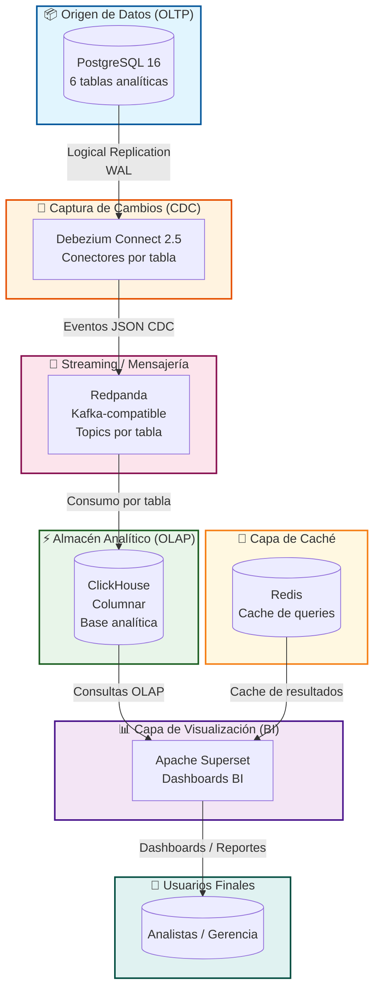
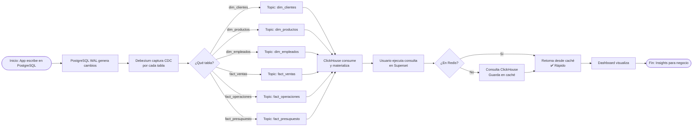
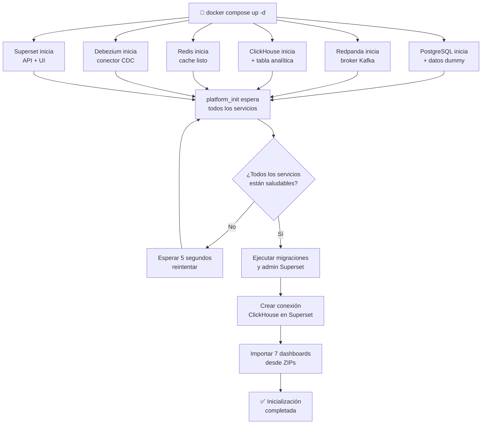
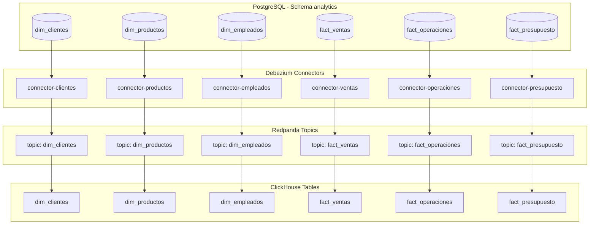
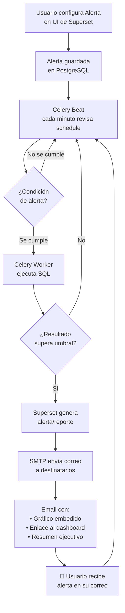

# 🏗️ Plataforma de Datos OLTP → CDC → OLAP → BI

> **Stack:** PostgreSQL 16 · Debezium 2.5 · Redpanda (Kafka-compatible) · ClickHouse · Apache Superset 6.0 · Redis · Docker Compose

---

## 1. Objetivo

Diseñar e implementar una plataforma de datos moderna que permita:

- Replicar datos desde PostgreSQL (OLTP) en tiempo casi real mediante CDC
- Desacoplar completamente la carga analítica del sistema transaccional
- Acelerar consultas analíticas con ClickHouse (OLAP columnar)
- Visualizar información con Apache Superset de forma segura y cacheada con Redis
- Garantizar reproducibilidad y portabilidad completa mediante Docker Compose

---

## 2. Diagrama de Arquitectura (Mermaid)



## 3. Diagrama de Flujo de Datos (Secuencia completa)



## 4. Diagrama de Flujo de Inicialización (Docker Compose)



## 5. Diagrama de Flujo de Datos (Vista por tabla)



6. Tabla de Fases del Proyecto
#	Fase	Descripción	Estado
1	Infraestructura base	Docker Compose con PostgreSQL, Redpanda, Debezium, ClickHouse, Redis, Superset	✅ Completado
2	CDC con Debezium	Replicación lógica de 6 tablas del schema analytics hacia topics Redpanda	✅ Completado
3	Datos dummy	Tablas y datos de prueba en PostgreSQL y ClickHouse para validación end-to-end	✅ Completado
4	Conexión ClickHouse → Superset	Script automático create_clickhouse_connection.py via API REST	✅ Completado
5	Dashboards BI	7 dashboards importados automáticamente desde ZIPs en superset/exports/	✅ Completado
6	Init automatizado	init.sh orquesta migraciones, admin, init, conexión CH y carga de dashboards	✅ Completado
7	Alertas y correos	Configurar Superset Alerts & Reports con SMTP para notificaciones automáticas	🔲 Siguiente
8	Dashboard de monitoreo	Dashboard interno de salud de la plataforma (lag CDC, estado conectores, métricas)	🔲 Pendiente
9	Authentik (SSO/IdP)	Autenticación centralizada con Authentik como proveedor OIDC/SAML para Superset	🔲 Pendiente
10	API Gateway	Traefik o Nginx como reverse proxy con rutas, TLS y rate limiting	🔲 Pendiente
11	Hardening producción	Secrets management, usuarios no-root, variables de entorno seguras, backups	🔲 Pendiente
12	Observabilidad	Prometheus + Grafana para métricas de contenedores y pipelines	🔲 Futuro

7. Servicios del Stack
Servicio	Imagen	Puerto	Rol
postgres	postgres:16	5432	Fuente OLTP, WAL lógico
redpanda	redpandadata/redpanda:v23.3.10	9092	Broker Kafka-compatible
debezium	debezium/connect:2.5	8083	CDC connector (6 tablas)
clickhouse	clickhouse/clickhouse-server:latest	8123 / 9000	OLAP columnar
redis	redis:7	6379	Cache de queries Superset
superset	apache/superset:6.0.0 + custom	8088	BI / Dashboards
platform_init	custom (postgres:16 base)	—	Orquestador de inicialización

8. Conectores Debezium activos
```text
analytics-dim-clientes      → topic: analytics.analytics.dim_clientes
analytics-dim-productos     → topic: analytics.analytics.dim_productos
analytics-dim-empleados     → topic: analytics.analytics.dim_empleados
analytics-fact-ventas       → topic: analytics.analytics.fact_ventas
analytics-fact-operaciones  → topic: analytics.analytics.fact_operaciones
analytics-fact-presupuesto  → topic: analytics.analytics.fact_presupuesto
```

9. Dashboards importados en Superset
Dashboard	Archivo ZIP
Ventas	dashboard_ventas.zip
Operaciones	dashboard_operaciones.zip
Clientes	dashboard_clientes.zip
Productos	dashboard_productos.zip
Empleados	dashboard_empleados.zip
Presupuesto	dashboard_presupuesto.zip
Analytics General	dashboard_analytics_general.zip

10. Estructura de Directorios
```text
data-platform/
├── docker-compose.yml
├── .env
├── Dockerfile.superset
├── Dockerfile.init
├── README.md
│
├── postgres/
│   └── docker-entrypoint-initdb.d/
│
├── sql/
│   ├── 01_postgres_dummy.sql
│   └── 02_clickhouse_dummy.sql
│
├── sh/
│   └── 03_debezium_connectors.sh
│
├── superset/
│   ├── superset_config.py
│   ├── init.sh                        ← orquestador principal
│   ├── create_clickhouse_connection.py
│   └── exports/
│       ├── dashboard_ventas.zip
│       ├── dashboard_operaciones.zip
│       ├── dashboard_clientes.zip
│       ├── dashboard_productos.zip
│       ├── dashboard_empleados.zip
│       ├── dashboard_presupuesto.zip
│       └── dashboard_analytics_general.zip
```

11. Comandos de operación

🔄 Ciclo completo (bajar → limpiar → levantar)
```bash
# 1. Bajar todo (volúmenes incluidos)
docker compose down -v --remove-orphans

# 2. Verificar ZIPs en su lugar
ls -lh superset/exports/

# 3. Construir y levantar
docker compose up -d --build

# 4. Monitorear init
docker logs -f platform_init

# 5. Monitorear Superset (en otra terminal)
docker logs -f superset
```

📋 Verificación rápida
```bash
# Estado de todos los contenedores
docker compose ps

# Salud de conectores Debezium
curl -s http://localhost:8083/connectors | python3 -m json.tool

# Estado individual de un conector
curl -s http://localhost:8083/connectors/analytics-fact-ventas/status | python3 -m json.tool

# Ping ClickHouse
curl -s http://localhost:8123/ping

# Ver topics Redpanda
docker exec redpanda rpk topic list
```

🧹 Limpieza selectiva (sin bajar todo)
```bash
# Solo reiniciar el init (para re-importar dashboards)
docker compose restart platform_init

# Solo reiniciar Superset
docker compose restart superset
```

12. Diagrama de Flujo de Alertas (Fase 7)



13. Variables de entorno (.env)

```env
# PostgreSQL
POSTGRES_USER=postgres
POSTGRES_PASSWORD=postgres123
POSTGRES_DB=postgres

# ClickHouse
CLICKHOUSE_DB=analytics
CLICKHOUSE_USER=default
CLICKHOUSE_PASSWORD=clickhouse123

# Superset
SUPERSET_SECRET_KEY=tu-clave-secreta-muy-larga
ADMIN_USERNAME=admin
ADMIN_PASSWORD=admin
ADMIN_EMAIL=admin@example.com
ADMIN_FIRST_NAME=Admin
ADMIN_LAST_NAME=User
```

14. Requisitos de infraestructura
Entorno	CPU	RAM	Disco
Dev / pruebas	4 cores	8 GB	50 GB SSD
QA / pre-prod	8 cores	16 GB	100 GB SSD
Producción inicial	16 cores	32 GB	300 GB SSD (IOPS altos)

15. Troubleshooting rápido
Síntoma	Causa probable	Solución
platform_init termina con error	Superset no listo aún	Aumentar sleep en el until del init.sh
Dashboards no importan	ZIPs no encontrados o mal nombrados	ls superset/exports/ y verificar nombres exactos
ClickHouse 409 en conexión	Conexión ya existe	Normal, ignorar
Debezium 404 al registrar	Debezium aún arrancando	El script reintenta automáticamente
Superset sin charts	UUID del dashboard no coincide con datasource	Re-exportar desde Superset con datos correctos
Celery worker no procesa alertas	Redis no conectado o celery no arranca	docker logs superset_worker

16. Flujo completo resumido (visión 30 segundos)

```mermaid
flowchart LR
    START((🗄️ PostgreSQL))
6 tablas
CDC activado
    START -->|WAL| CDC((🔄 Debezium))
2.5 connect
    CDC -->|eventos| KAFKA((📨 Redpanda))
topics por tabla
    KAFKA -->|consumo| CH((⚡ ClickHouse))
OLAP columnar
    CH -->|SQL| BI((📊 Superset))
Dashboards + cache
    BI -->|email| ALERT((📧 Alertas))
notificaciones
    BI -->|visualización| USER((👤 Usuarios))
insights de negocio
```

📌 Notas importantes

Todos los dashboards se importan automáticamente al primer inicio

El platform_init ejecuta la lógica solo una vez y luego se detiene (exit code 0)

Redis acelera las consultas repetitivas de Superset

ClickHouse ofrece compresión y velocidad para agregaciones complejas

El CDC es asíncrono → no afecta rendimiento del OLTP

🚀 Quick start (una vez clonado)

```bash
# 1. Clonar
git clone <tu-repo>
cd data-platform

# 2. Configurar .env (copiar ejemplo)
cp .env.example .env

# 3. Levantar todo
docker compose up -d --build

# 4. Ver logs del init
docker logs -f platform_init

# 5. Abrir Superset
http://localhost:8088
# Usuario: admin / Contraseña: admin
```
